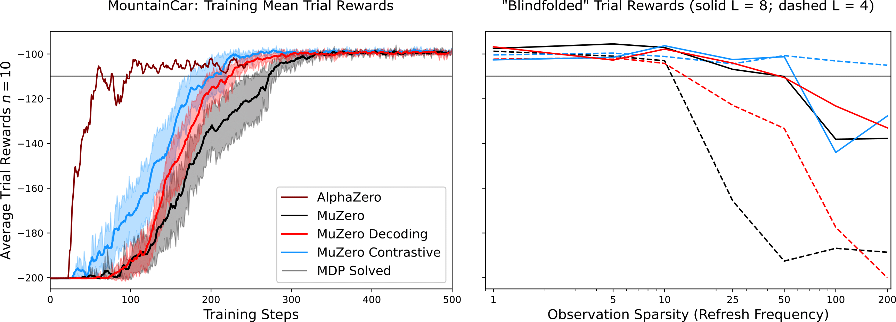

# MuZero Vs. AlphaZero in Tensorflow 
We provide a readable, commented, well documented, and conceptually easy implementation of the AlphaZero and MuZero algorithms based on the popular AlphaZero-General implementation. 
Our implementation extends AlphaZero to work with singleplayer domains, like its successor MuZero.
The codebase provides a modular framework to design your own AlphaZero and MuZero models and an API to pit the two algorithms against each other. 
This API also allows MuZero agents to more strongly rely on their learned model during interaction with the environment; the programmer can e.g., specify the sparsity of observations to a *learned* MuZero agent during a trial. 
Our interface also provides sufficient abstraction to extend the MuZero or AlphaZero algorithm for research purposes.

**beta phase**: Most of the codebase is done regarding development, we are currently working on finishing up this project and making it easily available for other users.

## How to run:
In order to run experiments/ train agents, you first need a .json configuration file (see [Configurations/ModelConfigs](Configurations/ModelConfigs)) for specifying the agent's parameters.
Within this .json file you also need to specify a neural network architectures (see [Agents/__init__.py](Agents/__init__.py) for existing architectures).
Then run Main.py with the following flags to train an agent:
```shell
python Main.py train -c my/config/file.json --game gym_Cartpole-v1 --gpu [INT]
```
See the [wiki](https://github.com/kaesve/muzero/wiki) for a more elaborate overview of the hyperparameters and how to create new agents or games.

### Minimal requirements
* Python 3.7+
 - tensorflow
 - keras standalone (until tensorflow 2.3 is available on anaconda windows)

#### Tested Versions (Windows and Linux)
* Python 3.7.9
 - tensorflow 2.1.0
 - keras 2.3.1

## Example Results
This codebase was designed for a Masters Course at Leiden University, we utilized the code to create visualizations of the learned MDP model within MuZero. 
We did this exclusively for MountainCar, the visualization tool can be viewed here: https://kaesve.nl/projects/cartpole-inspector/#/; an example illustration of this is shown below.
This figure illustrates the entire state-space from the MountainCar being embedded by MuZero's encoding network projected to the 3-PC space of the embedding's neural activation values. 


We quantified the efficacy of our MuZero and AlphaZero implementations also on the CartPole environment over numerous hyperparameters. 
The canonical MuZero can be quite unstable depending on the hyperparameters, the figure shows this through median and mean training rewards over 8 training runs.


The figure below illustrates the efficacy of learned models on MountainCar, when we only provide the MuZero agent observations every n'th environment step along with the agent's learning progress with dense observations.



No boardgames were tested for MuZero as computation time quickly became an issue for us, even on smaller boardsizes.
We did find that AlphaZero could learn good policies on boardgames, we found that it depends on the observation encoding. 
Heuristic encoding as used in AlphaZero seemed less effective to the canonicalBoard representation used in AlphaZero-General.

Our paper can be read for more details *here* (Will be added later).
 
## Our Contributions
There are already a variety of MuZero and AlphaZero implementations available:

- AlphaZero-General (any framework; sequential): https://github.com/suragnair/alpha-zero-general
- MuZero-General (Pytorch; parallelized): https://github.com/werner-duvaud/muzero-general
- MuZero in Tensorflow (Tensorflow; sequential): https://github.com/johan-gras/MuZero

Our implementation is intended to be both pedagogical and functional. 
So, we focussed on documentation, elegance, and clarity of the code. 
Ours also provides functionality for masking observations during trials and regularizing transition dynamics for fitting the MDP model.
We omitted parallelization as used in the original MuZero paper due to this reason; but it can be implemented in the future.

## References
- Schrittwieser, Julian et al. (Feb. 21, 2020). “Mastering Atari, Go, Chess and Shogi by Planning with a Learned Model”. [cs, stat]. arXiv:1911.08265
- Silver, David et al. (Dec. 2018). “A general reinforcement learning algorithm that masters chess, shogi, and Go through self-play”. In:Science 362.6419, pp. 1140–1144.DOI:10.1126/science.aar6404


